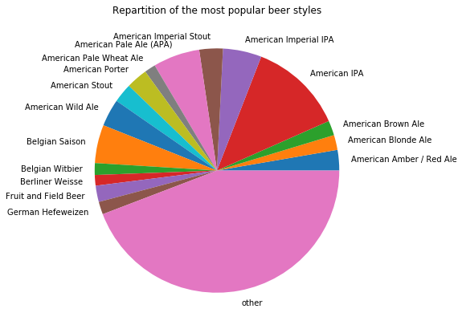
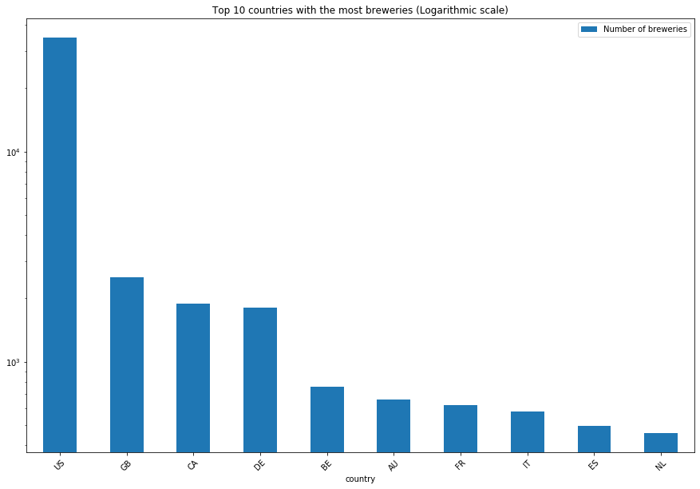
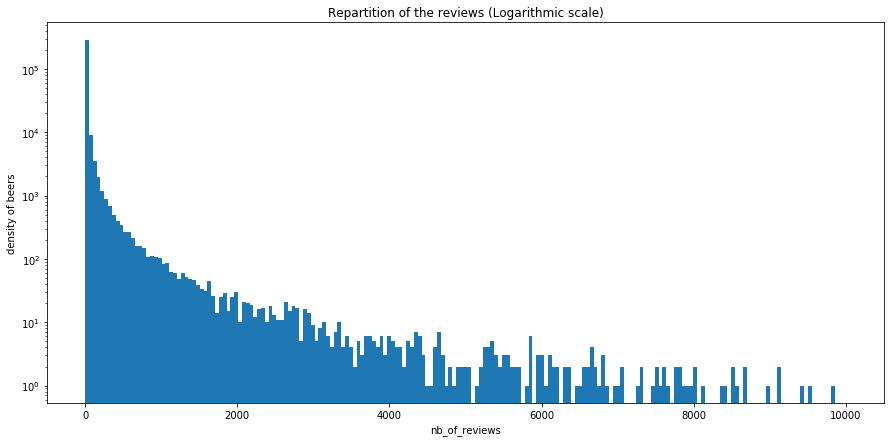

# Project of Data Visualization (COM-480)

| Student's name | SCIPER |
| -------------- | ------ |
|Loïc Vandenberghe|257742 |
| Robin Leurent|250699 |
| Alexis Dewaele| 247185 |

[Milestone 1](#milestone-1-friday-3rd-april-5pm) • [Milestone 2](#milestone-2-friday-1st-may-5pm) • [Milestone 3](#milestone-3-thursday-28th-may-5pm)

## Milestone 1 (Friday 3rd April, 5pm)

**10% of the final grade**

### Dataset

For our project, we picked the dataset called "Beers, Breweries, and Beer Reviews" from [Kaggle](https://www.kaggle.com/ehallmar/beers-breweries-and-beer-reviews).
The source of the dataset comes from [Beer Advocate](https://www.beeradvocate.com/).
It contains information about various craft beers from all around the world. The dataset is composed of three CSV files : beers.csv, breweries.csv and reviews.csv.

The beers.csv file contains information about around 358'000 craft beers :
* its name
* its brewery
* its state
* its country
* its availability
* its alcohol per volume measurement
* its style
* some notes about it
* whether the beer is still for sale

The breweries.csv file contains information about 50'000 breweries :
* its city
* state
* country of origin
* type of brewery ( bar, shop, eatery...)

The reviews.csv file contains around 9 000 000 reviews from users:
* 'beer_id'
* 'username'
*  'date'
* 'text' reviews from the user
* 'look'  (from 0 to 5)
* 'smell'
* 'taste'
* 'feel',
* 'overall'
* 'score' (average of all scores)

**Preprocessing needed :**

There is little preprocessing that needs to be done. As mentioned above, the beers dataset contains information whether this beer has been discontinued or not. Since we want to show our target audience current craft beers from all over the world, we can filter out the beers that are not sold anymore.
Beers and breweries can have missing values for there state or alcohol per volume
Some pre-processing on the reviews might be needed since the reviews data table has the following problems:
    * Some beers have too few reviews to get some relevant data. (doing the average score of each beer will not be relevant for beers with only one reviews)
    * Some reviews have NaN values in the look, smell, taste and feel categories.
    * Some reviews have inconsistent scores for categories and overall. (for example a score of  1.0 for all categories but the maximum score for overall and vice-versa)

### Problematic

We want to build a visualization tool that will help fellow craft beer enthusiasts find their next favorite craft beer !
We would like to provide our audience with an interactive platform which will allow him/her to discover locally crafted beers according to some specificity (e.g. country of origin, type...).
A first visualization idea would be an interactive world map where a user could find out the most popular beer (or type of beer) in a specific country. This could be very useful for a craft beer amateur in vacation.

### Exploratory Analysis

Our dataset is composed of exactly 358'873 beers, 50'347 breweries and 9'073'128 reviews.
As we mentioned above, some beers have been taken out of shops and in our dataset, there is 49.23% of such beers.

Below, we plotted the distribution of the top beer styles :

and the distribution of the 10 countries having the most breweries :

Finally, we plotted the distribution of beers per number of reviews. On the x axis you have the number of reviews and on the y axis the number of beer that have this many reviews (in log scale). Hence this is the density of beers on the reviews axis. We can see that most of the beers only have really few number of reviews (between 0 and 50) since a only few beers has more than 2000 reviews.

### Related Work

From what we've found on Kaggle, the work that has already been done with this dataset has been mostly statistical analysis with next to no visual component.
We believe that our approach can provide a much more intuitive way for a user to find new craft beers rather than looking at a boring histogram.

Inspiration : https://www.import.io/post/data-visualization-beer-tastes/
This visualization is centered on the United States of America, but we would like to create something similar for the entire world. Also, this visualization does not provides the actual beers, only statistics.

## Milestone 2 (Friday 1st May, 5pm)

**10% of the final grade**

The code for our prototype is located in the "src" folder.

## Milestone 3 (Thursday 28th May, 5pm)

**80% of the final grade**

First of all, unzip the "data" folder.

To run the website, you need to deploy a local server using the command `python -m http.server` and you can access the website by typing "localhost:8000" in the browser of your choice. Then, select the "src" link. **Please know that our project is meant to be seen fullscreen on either Google Chrome, Safari or Opera**.

Once you are on our website, you can pan and zoom the map. You can also click on a country to obtain more information about it (on the right side of the screen) and zoom on this country. To return to a world view, click on the "Return to world view". You can also visualize various information about the beers in our dataset by changing the filters at the top of the map.

Finally, you can use the search bar to search beer or brewery names. The result of these searches or displayed on the map by popups that are located where the beer/brewery is located along some information.
